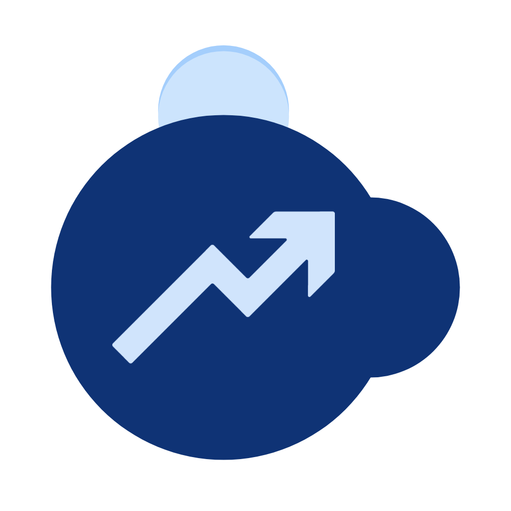

<!-- PROJECT LOGO -->
<br />
<div align="center">
  <a href="https://github.com/othneildrew/Best-README-Template">
    
  </a>

  <h1 align="center">Monekin - Official repository</h1>

  <p align="center">
    Monekin is a 100% Open Source app that tries to make personal finances easier. Fast, simple, without ads, without the need for an Internet connection and with a groundbreaking design, that's Monekin.
    <br />
    <a href="#about-the-project"><strong>Start exploring »</strong></a>
    <br />
    <br />
    <a href="https://play.google.com/store/apps/details?id=com.monekin.app">
      
    </a>
  </p>
</div>

<!-- TABLE OF CONTENTS -->
<details>
  <summary>Table of Contents</summary>
  <ol>
    <li>
      <a href="#about-the-project">About The Project</a>
      <ul>
        <li><a href="#why-monekin">Why Monekin?</a></li>
        <li><a href="#tech-stack">Tech Stack</a></li>
      </ul>
    </li>
    <li>
      <a href="#run-the-code-locally-">Run the code locally</a>
      <ul>
        <li><a href="#prerequisites">Prerequisites</a></li>
        <li><a href="#installation">Installation</a></li>
      </ul>
    </li>
        <li>
      <a href="#contributing-">Contributing</a>
      <ul>
        <li><a href="#why-to-contribute">Why to contribute?</a></li>
      </ul>
    </li>
    <li><a href="#contact">Contact</a></li>
  </ol>
</details>

## About the project

|          |             |                |       |
| :---:    |    :----:   |          :---: | :---: |
|  |  |  | 
|  | 

### Why Monekin?

After a lot of research on the marketplaces I could not find any application that met all my needs. That is why I decided to start making my own app. After months of hard work, the first version was released on Google Play in October 2021. I decided to make it 100% Open Source shortly after, with the aim of increasing its user community, and that external developers could help and collaborate with me on the project. Since the day of its release, the app has been continuously improving and updating.

### Tech Stack

Developed in Ionic and Angular, which allows it to be a modern and scalable application to a large number of operating systems and platforms.

## Run the code locally 🚀🧑‍💻

The following explains how to run the project code locally. This way you will be able to investigate on your own how it is done, create new features, fix bugs, etc.

### Prerequisites

As with any Angular project, you will need to have Node.js installed. To install it go to [here](https://nodejs.org/en/download/). Note the [Angular compatibility matrix](https://gist.github.com/LayZeeDK/c822cc812f75bb07b7c55d07ba2719b3) to download a compatible version. You should also have git installed in your machine.

### Installation

Open a terminal on your computer and go to the folder where you want to place the project. Then clone the project and install the dependencies by typing the following commands:

```
git clone https://github.com/enrique-lozano/Monekin.git
```
```
cd Monekin
```
```
npm install
```

If everything went correctly these commands will finish executing without errors. Now you can run <code>npm run start:browser</code> on your terminal. When this command finish, you can open <code>http://localhost:4200</code> in your favourite browser to see the app running. The app will be refreshed when changes in the code appear.

## Contributing 🙋🏻

Contributions are what make the open source community such an amazing place to learn, inspire, and create. Any contributions you make here are **greatly appreciated**. 

Read through our [contributing guidelines](https://github.com/enrique-lozano/Monekin/blob/main/CONTRIBUTING.md) to learn about how you can collaborate making Monekin better. **All Pull Requests are welcome** and will be studied without exception!

### Why to contribute?
- We can learn for you and you can learn from us.
- You'll appear in our contributors wall.
- You can **include it in your CV/LinkedIn** and show recruiters that you contribute to open-source projects.
- You'll make Monekin better.
- You can develop the features that you miss in the app yourself, the way you want them.
- You'll play around and learn cutting-edge technologies.
- It's the easiest way to learn Angular/Typescript/SCSS... in a production environment.
