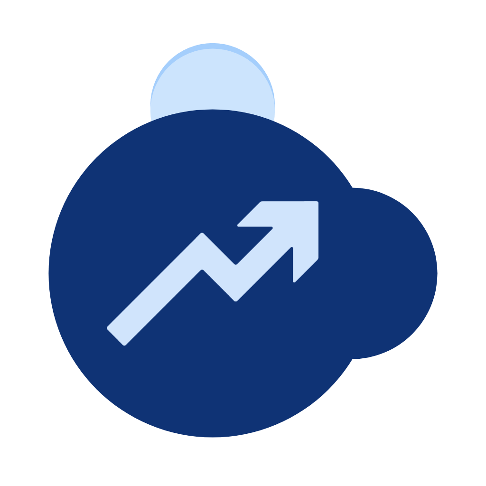

<!-- PROJECT LOGO -->
 

  

  <h1 align="center">Monekin - Official repository</h1>

  

    Monekin — a 100% open source app that makes personal finances easier. Fast, simple, offline-first, no ads, and a groundbreaking design.
     
    <a href="#about-the-project"><strong>Start exploring »</strong></a>
     
     
    
     &nbsp; 
    
  

<!-- TABLE OF CONTENTS -->

  
Table of Contents

  <ol>
    <li>
      <a href="#about-the-project">About The Project</a>
      <ul>
        <li><a href="#why-monekin">Why Monekin?</a></li>
        <li><a href="#tech-stack">Tech Stack</a></li>
      </ul>
    </li>
    <li>
      <a href="#run-the-code-locally-">Run the code locally</a>
      <ul>
        <li><a href="#prerequisites">Prerequisites</a></li>
        <li><a href="#installation">Installation</a></li>
      </ul>
    </li>
        <li>
      <a href="#contributing-">Contributing</a>
      <ul>
        <li><a href="#how-to-get-started">How to get started</a></li>
        <li><a href="#why-to-contribute">Why to contribute?</a></li>
        <li><a href="#support-the-project-">Support the project</a></li>
      </ul>
    </li>
  </ol>

## About the project

### 📸 Screenshots

|                                                                                                                    |                                                                                                                    |                                                                                                                    |                                                                                                                    |
| :----------------------------------------------------------------------------------------------------------------: | :----------------------------------------------------------------------------------------------------------------: | :----------------------------------------------------------------------------------------------------------------: | :----------------------------------------------------------------------------------------------------------------: |
|  |  |  |  |
|  |  |

### 🕰 History of Monekin

Monekin was born from the frustration of not finding any app that could meet all my personal finance needs and functionality requirements. None of the existing solutions provided the balance between simplicity, features, and usability that I was looking for.

So, I decided to create one myself. After months of development and hard work, Monekin was released on Google Play in October 2021. Shortly after, it became 100% open-source, not only to involve external developers in improving the app but also to increase user confidence and transparency. Since then, the app has continued to grow and update continuously, thanks in part to this community of users and contributors.

### 🌟 Why Monekin? 

- **💸 Unlimited Transactions & Accounts** - Track everything across as many accounts as you need, and drill into stats per account.
- **🔁 Recurring Transactions** - Automate bills and subscriptions (streaming, utilities…) so nothing slips by.
- **📈 Net Worth & Assets** - A 360° view of your wealth: cash, properties, investments, and debts, and how they grow over time.
- **💼 Investment Tracking** - Follow stocks, funds, and crypto as a real portfolio, trade by trade or from a simple snapshot of what you hold.
- **🎯 Budgets & Goals** - Set spending limits and savings goals, and stay on track with clear progress.
- **📊 Powerful Analytics** - Rich statistics, charts, and a Financial Health score that looks at savings, debt, cash flow, and investing.
- **🎨 Custom Categories & Icons** - Unlimited categories and subcategories, with hundreds of beautiful icons to make them yours.
- **💱 Multi-Currency** - 50+ currencies with exchange rates you can customize.
- **💾 Local Backups & Data Control** - Unlimited local backups you own and restore on any device. No servers, no subscriptions.
- **📴 Works Offline** - Full functionality with no internet connection required, anytime, anywhere.
- **🔓 Open Source** - Fully transparent and community-driven, so you can trust it and help shape it.
- **✨ Free, Forever** - No ads, no hidden fees. Just your finances.

### 🛠 Tech Stack

At the beginning the app was developed in Ionic and Angular. In 2023, in order to make our app better, we migrated the app to Flutter, which allow us to have a much more modern and faster application while maintaining compatibility with a large number of operating systems and platforms.

To store and persist your data in the app we store a SQLite database directly in your device, thanks to an opensource package called [drift](https://github.com/simolus3/drift)

## Run the code locally 🚀🧑‍💻

Interested in exploring the code? Whether you're looking to review it for security and privacy, curious about how the app works, or considering contributing, we’ve got you covered! Check out our [this guide](https://github.com/enrique-lozano/Monekin/blob/main/docs/RUN_THE_CODE_LOCALLY.md) for detailed, step-by-step instructions.

## Contributing 🙋🏻

At Monekin, we believe that the open-source community thrives on collaboration, creativity, and shared knowledge. Whether you’re a developer, designer, translator, or just a fan of the app, **your contributions matter** and make a real difference.

### How to Get Started

- **General Contributions**: Not sure where to begin? Start by reading our [Contributing Guidelines](https://github.com/enrique-lozano/Monekin/blob/main/CONTRIBUTING.md), designed for technical and non-technical contributors alike. Here you will learn about how you can collaborate making Monekin better.
- **Code Contributions**: If you’re a developer looking to dive into the codebase, we’ve got a dedicated [Code Contributing Guide](https://github.com/enrique-lozano/Monekin/blob/main/docs/CODE_CONTRIBUTING.md). This guide walks you through setting up your environment, following coding standards, and submitting pull requests.

### Support the project 💖

If you love Monekin and want to support its development, consider making a donation. Your contributions help keep the app free, open-source, and constantly improving.

 &nbsp; 
  

 &nbsp; 

---

A huge **THANK YOU** to all the amazing users of Monekin! Your support means the world to us and drives us to continue making personal finances simpler for everyone.
